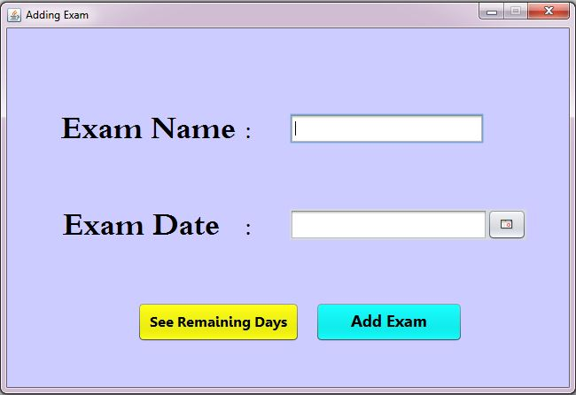
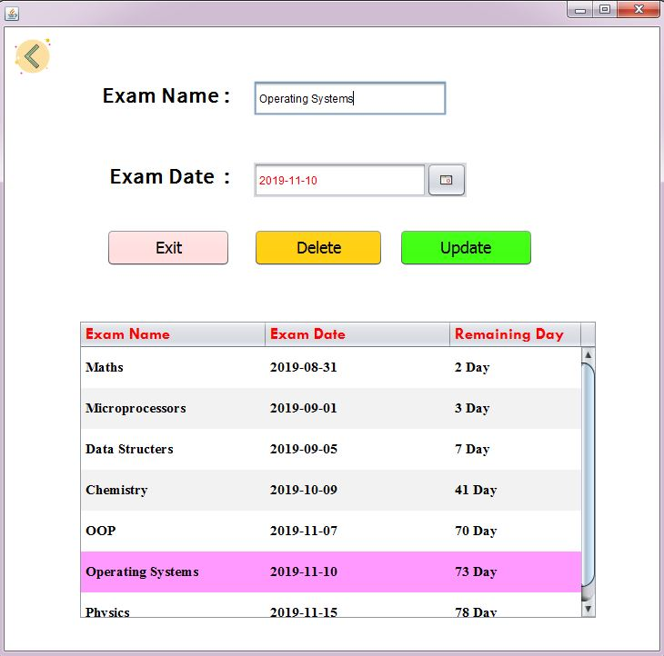

# Exam Counter

Exam Counter is a Form application made using java swing and sqlite,it shows days remaining for your exam.

## Screenshots

## Requirements 

- [JCalendar](http://www.java2s.com/Code/JarDownload/jcalendar/jcalendar-1.1.4.jar.zip)
- [Sqlite JDBC](https://bitbucket.org/xerial/sqlite-jdbc/downloads/sqlite-jdbc-3.27.2.1.jar)

## Installation 

- Press the Fork button (top right the page) to save copy of this project on your account.
- Download the repository files from the download section or clone this repository with the following command.

      git clone https://github.com/emreziplar/ExamCounter.git

- Open the project on Netbeans.

or

- Download and run [here](https://github.com/emreziplar/ExamCounter/blob/master/ExamCounter.rar?raw=true).

# Note

On the GUI of this application has not been worked much. If you want develop this app a little more , do it :).

#### Thank you ツ
